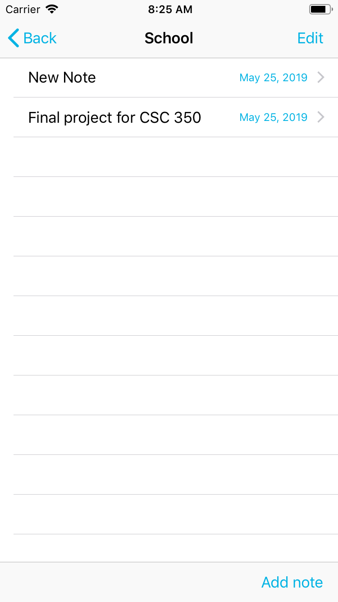
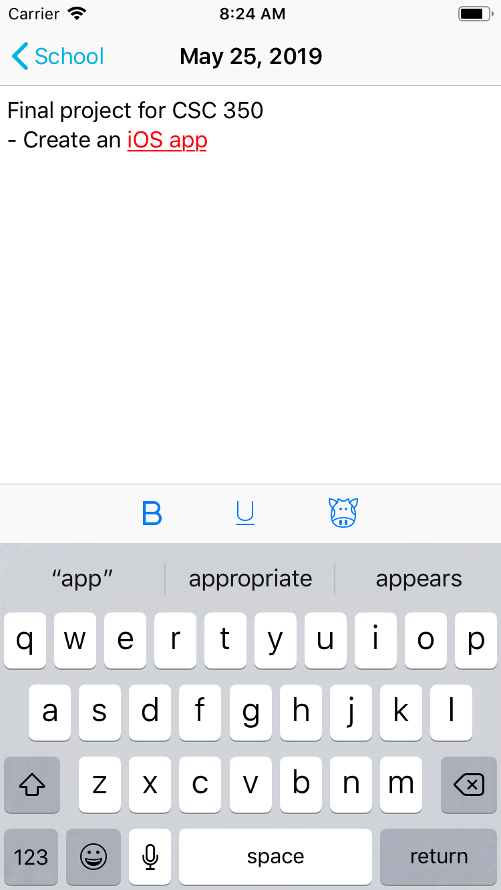

# The Movie Manager App
## 

### What Used?
- Swift 5 and Xcode
- CoreData for data persistence

### What it does?

### Demo
Welcome Page                 |2                               | 3
:---------------------------:|:------------------------------:|:------------------------------:
             |             | 

1                            |  2                             | 3
:---------------------------:|:------------------------------:|:------------------------------:
            |               | 
